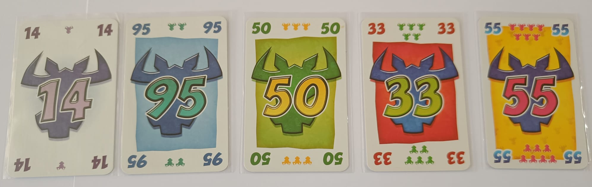

# PROYECTO DE ALGORITMOS Y ESTRUCTURAS DE DATOS I
**Curso 2023-2024**

# ¡Toma 6!

¡No es un juego para bueyes! Tienes 10 cartas para jugar, de manera inteligente, en una de las cuatro filas. Pero ¡atención! en cada fila sólo caben cinco  cartas. Así que, si colocas la sexta carta de una fila, tendrás que coger las cinco que haya, con todos sus bueyes (puntos negativos). Así se nos presenta ¡Toma 6!, uno de los clásicos en el mundo de los fillers. Diseñado por el incombustible Wolfgang Kramer en 1994 (hace ya 20 años) bajo el original  nombre de Category 5.

# Mecánica
¡Toma 6! es un juego de bazas en el que los jugadores (2 a 10) seleccionan la carta a jugar de forma simultánea. Cuando un jugador coloque la sexta  carta en una fila, deberá llevarse las cinco que había en dicha fila. Se juegan rondas hasta que algún jugador **alcanza o sobrepasa los 66 puntos**.

**Conceptos Básicos**

El elemento básico del juego son sus cartas. Estas cartas se encuentran numeradas (del 1 al 104) y son únicas (no hay cartas repetidas). Además, cada carta posee un número de cabezas de buey (pequeños símbolos encima del logotipo del juego que está presente en todas las cartas). Estos pequeños símbolos representan el número de puntos negativos (bueyes) que aporta dicha carta a la hora de ser tomada por un jugador.

	

El número de bueyes de una carta sí que depende del valor de la misma:

* Cartas terminadas en 5 (5, 15, 25, etc): 2 bueyes.
* Cartas múltiplos de 10 (10, 20, 30, etc): 3 bueyes.
* Cartas múltiplos de 11 (11, 22, 33, etc): 5 bueyes.
* El 55 es un caso especial: 7 bueyes (es múltiplo de 11 y termina en 5).
* El resto de cartas: 1 buey.

El concepto clave del juego es la colocación de las cartas. En la mesa tendremos una serie de filas, compuestas por cartas. Cada carta debe ser colocada en aquella fila cuya última carta sea inferior a la carta a colocar y, además, la diferencia entre esa última carta de la fila y la carta a colocar sea la menor de todas las posibles.

**Preparación de la Partida**
* Se baraja todo el mazo de cartas (104 cartas).
* Se reparte a cada jugador 10 cartas (jugadores entre 2 y 10).
* Se colocan 4 cartas en la mesa para el inicio de la partida.

# Desarrollo de la Partida

La partida dura un número indeterminado de rondas. Las rondas se completan totalmente (no se dejan a medias). Por cada ronda se van a jugar 10  turnos. Cada turno se desarrolla de la siguiente
manera:

1. Cada jugador elige una de las cartas de su mano y la coloca boca abajo en la mesa.
2. Una vez que todos han elegido una carta, la revelan simultáneamente.
3. Se juegan las cartas de menor a mayor y se van colocando sobre las filas (comprobando si algún jugador debe tomar cartas de alguna fila).
4. Una vez que se han colocado todas las cartas, se repite el proceso hasta que todos los jugadores se han quedado sin cartas.

En el momento que la carta de un jugador se coloque en la sexta posición de una fila, ese jugador deberá tomar las cinco cartas anteriores, anotando en su marcador el número de cabezas de bueyes impresas en ella, y dejando como inicio de la fila la carta que eligió.

Si la carta de un jugador es inferior a todas las cartas finales de cada fila, entonces el jugador deberá elegir una fila cualquiera y tomar todas las cartas que la componen, anotando los puntos correspondientes, dejando como comienzo de la fila la carta que eligió.

Si, al finalizar la ronda, ningún jugador ha alcanzado o superado los 66 puntos, se vuelve a preparar una nueva ronda y se continúa jugando.

# Fin de la Partida

La última ronda será aquella en la que un jugador haya alcanzado o sobrepasado los 66 puntos. Tras completarla, **el ganador será aquel jugador (o jugadores en caso de empate) con menos puntos acumulados**.

Vídeo explicativo: https://www.youtube.com/watch?v=CnHN4_jSNuE

# ORGANIZACIÓN DEL TRABAJO A REALIZAR

1. El trabajo será **colaborativo**, es decir se realizará en grupo de 4/5 alumnos/as. La formación de los equipos corre por cuenta de los/as alumnos/as, anotándose a los grupos disponibles en Moovi.

2. El trabajo consiste en desarrollar un proyecto que implemente el juego del **Toma 6** siguiendo las reglas anteriormente expuestas, utilizando el  lenguaje de programación Java y el entorno NetBeans.

3. Cada miembro del grupo debe ser responsable de su trabajo, de comunicarse con otros miembros del grupo y de conocer todas las partes del proyecto.

  

# ENTREGAS A REALIZAR
El proyecto a realizar será tutorizado por el/la profesor/a para lo cual se exigirán **3 entregas completamente funcionales**. La descripción de las tareas/funciones a realizar en cada una de las entregas, así como la fecha tope de subida de cada entrega se irá indicando en la plataforma Moovi. Cada entrega será presentada de forma obligatoria por todos los miembros del grupo al profesor/a, la no participación en dicha defensa implica la expulsión  del grupo. El/La profesor/a acordará con cada grupo cuándo se realizará la presentación, siempre en la siguiente semana a cada entrega. El objetivo de cada presentación es conocer el grado de implicación de cada componente del grupo en la entrega y realizar las correcciones oportunas que garanticen el correcto desarrollo del proyecto para conseguir el juego final.

**El hallazgo de copias de entregas supondrá el suspenso de la parte práctica, tanto para el grupo con código original, como para el grupo con código copiado**.

# EVALUACIÓN
La evaluación constará de dos partes: 1 evaluación grupal, correspondiendo con la última entrega, en forma de tutoría obligatoria; y 1 evaluación individual en forma de examen en el ordenador.

1. **Evaluación grupal**: **tutoría obligatoria** para todos los miembros del grupo, en la que se mostrará el proyecto finalizado y donde el/la profesor/a pondrá preguntar a cada miembro del grupo sobre su trabajo o sobre el de sus compañeros. Esta evaluación supondrá el *20% de la calificación final* de la asignatura.
2. **Evaluación individual**: se realizará en ordenador el **5 de junio de 2024**. Supondrá el *25% de la calificación final* de la asignatura.
